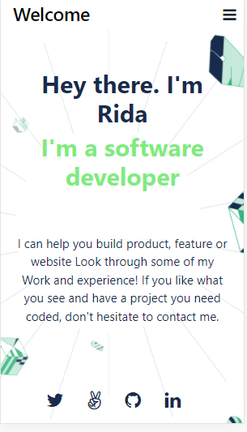
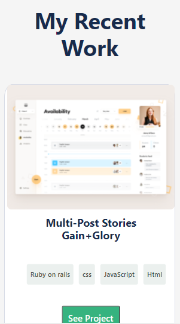
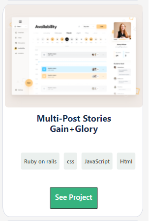
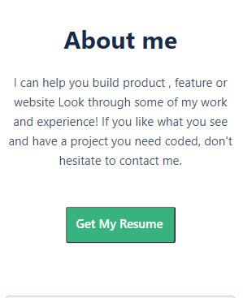
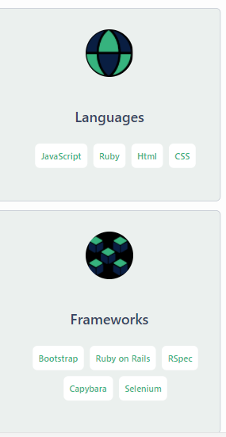
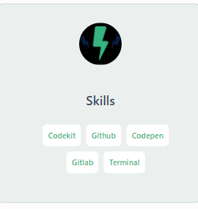
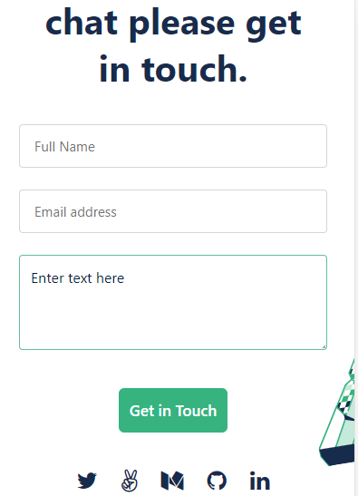

# MyPortfolio
#This is MyPortfolio Project
    This is simple Project.Which has header, Section.Inside header there is logo and menu icon.
    Inside section some pictures. My itroduction in paragraph.I add a work section where details of my work. And after my work is my skill section where I add detailas of languages, frameworks and skills.And at the bottom there is footer, and inside footer I added a contact form.
    In the stylesheet add media quries to make the portfolio desktop responsive.

  

  

  

  
  
  
  
  
  ## Built With

- Html,CSS
- Git, Github
- Visual Studio Code

## Getting Started

**This is an example of how you may create your mobile responsive porfolio**

##Prerequisites

Create repository
Clone it local device using git
Add files , commit and push them to github
Run linters 
Deploy to resolve errors

